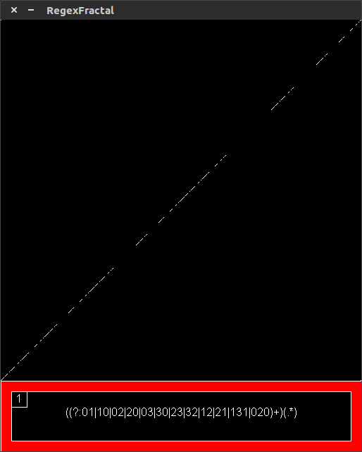
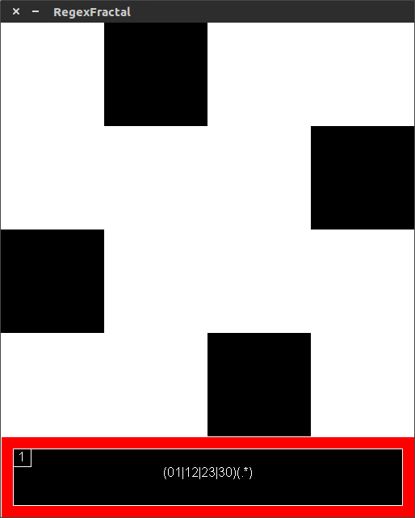

# Regex-Fractals

Generate fractals from regular expressions. Uses regex capture to determine colors in various modes. Can change depth of the fractal and cycle through various coloring modes. Implemented in [processing](http://processing.org/)

## How it Works

Divides a square into four quadrants labelling each with a digit. The dividing process is repeated with each digit appended until each pixel has its own unique string of digits. When the regular expression matches the unique identifier for the pixel, it is colored in. In different coloring modes, the length of captures determines the color of the pixel.

## Inspiration

The idea for this project came from a [blog post on ssodelta](https://ssodelta.wordpress.com/2014/03/24/generating-images-from-regular-expressions/) as well as [a variation by christianp](http://christianp.github.io/regex-fractals/) that adds color based on capture data. This version adds extra coloring modes as well as a controls that allow for the depth (number of times the image is divided) of the fractal to be changed. This was an independent school project made by my partner, Ben, and I.

## Installation

For use in processing add the RegexFractal folder to your sketchbook.

## Demonstration

